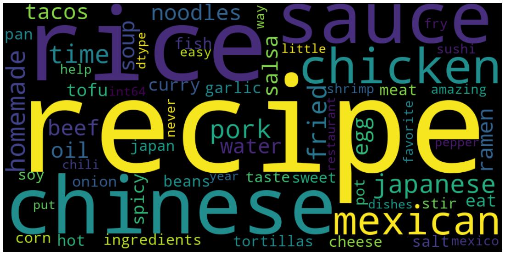

# Project 3 : Text Classification of Subreddit Food topics into 3 classes, Japanese, Chinese or Mexican based on historical post titles and comments using Natural Language Processing.

     
     

## Problem Statement.

+ A marketing team for a food based startup company wants a model to easily classify their email inquiries from customers, plus get some insights on top keywords and topics that people online are actively discussing about and further craft their online content and improve on their SEO.

## Executive Summary.

+ NLP is a pre-processing step that helps convert human interpretable language content into machine readable format. Later we can build ML models in order for computer to interpret the preprocessed content and make useful predictions or inferences to accomplish or goals. 

+ Some uses of NLP include Email Filter, Predictive Text, Language Translation, Smart Assistants (bots) to name a few. [Read more][1].

+ For this project, i'll build a classifying model that can help categorize all food enquiries from our client, to demonstrate this I will use data from popular news aggregation, web content rating, and discussion website www.Reddit.com  [Japanese Food][2], [Chinese Food][3], [Mexican Food][4]. 

[1]: "https://www.tableau.com/learn/articles/natural-language-processing-examples"
[2]: "https://www.reddit.com/r/JapaneseFood/"
[3]: "https://www.reddit.com/r/chinesefood/"
[4]: "https://www.reddit.com/r/mexicanfood/"

## Contents.

+ [Import Data and Export as .csv - separate file](SamayShah_Project3_DataCleaning.ipynb)
+ [Data Cleaning](SamayShah_Project3_DataPreprocessingandModelBuilding.ipynb#Data-Cleaning)
+ [EDA / Preprocess](SamayShah_Project3_DataPreprocessingandModelBuilding.ipynb#EDA-and-Pre-process)
+ [Model-1 Logistic Regression](SamayShah_Project3_DataPreprocessingandModelBuilding.ipynb#Model-1-Classifier:-Logistic-Regression,-Vectorizer:-Tfidf)
+ [Model-2 Tree Based - Random Forest](SamayShah_Project3_DataPreprocessingandModelBuilding.ipynb#Model-2-Classifier:-Random-Forest,-Vectorizer:-CountVectorizer)
+ [Model-3 Tree Based - Ada Boost](SamayShah_Project3_DataPreprocessingandModelBuilding.ipynb#Model-3-Classifier:-AdaBoostClassifier)
+ [Model-4 Naive Bayes - Multinomial](SamayShah_Project3_DataPreprocessingandModelBuilding.ipynb#Model-4-Classifier:-Multinomial-Naive-Bayes,-Vectorizer:-CountVectorizer)
+ [Model-5 SVM - Support Vector Classifier](SamayShah_Project3_DataPreprocessingandModelBuilding.ipynb#Model-5-Classifier:-SVM-(Support-Vector-Clssifier),-Vectorizer:-CountVectorizer)
+ [Model Comparison](SamayShah_Project3_DataPreprocessingandModelBuilding.ipynb#Comparing-scores-for-all-Models)
+ [Recommendations](SamayShah_Project3_DataPreprocessingandModelBuilding.ipynb#Insights)
+ [What Else!](SamayShah_Project3_DataPreprocessingandModelBuilding.ipynb#Scope-of-this-project)

## Project Flow

+ Using PushShift API, i'll fetch data from all 3 subreddits(titles,Comments etc), Clean and explore data using Pandas library, preprocess content using NLP libraries like BeautifulSoup, NLTK and Sklean, build several ML models to obtain best classification accuracy. Lastly, compare using visualizations and evaluation metrics like ConfusionMatrix, ClassificationReport, AUC score etc.

**3 Subreddits - TRAIN DATASET FILE (~10000 rows)**

+ Main File contains train dataset and other EDA. Should not be modified.

**3 Subreddits - TRAIN DATASET FILE (~6000 rows)**

+ File to try test datasets. Copy .csv file containg housing information to predict in the 'datasets' folder. Name your file as 'test.csv' or else you can change the file path in cell#3 of test file. Run call cells and close the file.

**5 MODELS**

1. Logistic Regression
2. Random Forest
3. Ada Boost
4. Multinomial Naive Bayes
5. SVM

**1 Dataset Folder - FoodData (6.csv files)**
**1 Images Folder**
**1 Presentation Folder**

**Outiside - in Main Folder**
+ Data Cleaning File
+ EDA and Modeling File
+ Sample Keywords .csv file for the Marketing Team

**Readme File**

## Insights

**Based on my models, I found following keywords to be used the most among all 3 subreddits**

+ These words definitely makes sense like Japanese Cuisine has the word 'ramen' appear very frequently compared to 'noodles' for Chinese Cuisine.
+ Among Japanese food, Rice, Ramen and Sushi tops the list, for Chinese, Rice, Pork, Chicken and Noodles comprise of the top few, while for Mexican food, Tacos, Salsa, Tortillas and Corn keywords are talked about more frequently.
+ Certain items like homemade, Rice, Chicken and Eggs are consistenly used amoung all cuisines.
+ To add, SEO can use certain Japanese keywords like 'udon', 'okonomiyaki','katsu', Chinese keywords like 'sinchuan' or Mexican words like 'quesso', 'chiles', 'carne' on their online menu to increase their rankings.

## Future Scope:

+ This model could further be expanded across more cuisines and diverse data can be collected from multiple platforms to increase models accuracy.

Thankyou
@@@@@@@@@@@@ Samay Shah @@@@@@@ General Assembly @@@@@@@@@ Project-3 @@@@@@@@@ Samay Shah @@@@@@@@